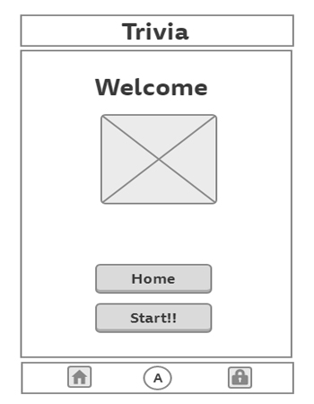
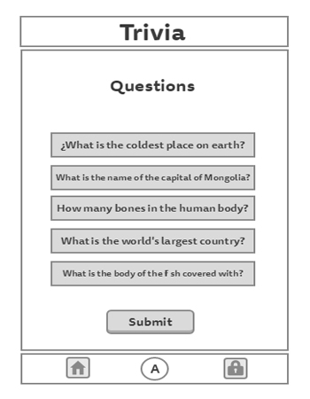
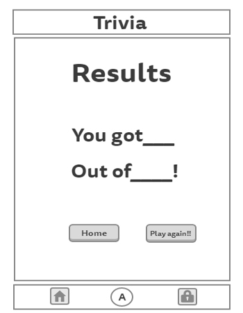
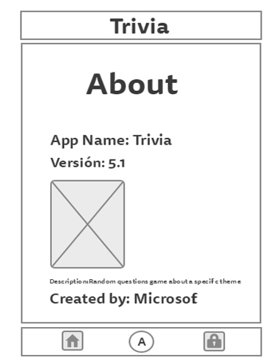

#Trivia

Tecnologías utilizadas: react, react-dom,framework de boostrap, webpack, npm, jsx, react-router,
api,

Descripción: Aplicación desarrollada para el entretenimiento de las personas.
Esta app responsive es muy dinámica ya que te lanza un Random de preguntas
de algún tema en especifíco y al final te brinda tus resultados.

Desarrollada para: Laboratoria.

Para la generación al azar de estas preguntas se hace el consumo de la api de
Open Trivia DB. [Trivia DB](https://opentdb.com/api_config.php)

A continuación se muestra el flujo de la aplicación de manera general.

Vista final del Home proyecto

